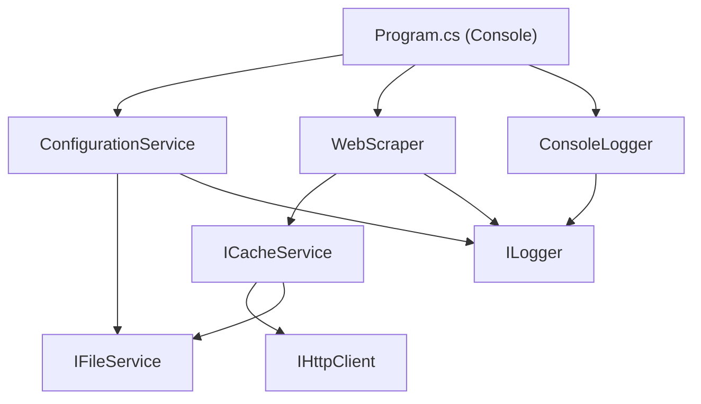

The JW Enjoy Life Scraper is organized as a .NET 9 solution (`WebsiteMediaScraper.sln`) containing two projects: a reusable class library (`Lib`) and a console executable (`Console`). The library owns all scraping, caching, HTTP, and file-I/O logic, while the console project wires everything together through `Program.cs` and provides the terminal UI via `ConsoleLogger`. This separation means the core library can be tested or reused independently of any particular UI front-end.

## Solution structure

```
WebsiteMediaScraper.sln
├── Lib/                        # Class library (net9.0)
│   ├── Interfaces/             # IWebScraper, ICacheService, IHttpClient, IFileService, ILogger
│   ├── Services/               # WebScraper, CacheService, CustomHttpClient, FileService, ConfigurationService
│   ├── Dto/                    # JsonResponse, FileDetail, MovieDetail, File, PubImage, LanguageDetail
│   ├── Helper.cs               # Hashing, file-size formatting, metadata, filename sanitization
│   └── EnumHelper.cs           # Enum ↔ string conversion via EnumMemberAttribute
└── Console/                    # Executable (net9.0, PublishSingleFile=true)
    ├── Program.cs              # Entry point — orchestrates the full scrape + download flow
    └── ConsoleLogger.cs        # ILogger implementation backed by Spectre.Console
```

## Dependency diagram

The diagram below shows how the Console layer depends on each service and how services depend on their interfaces.



<Note>
  All inter-service communication goes through interfaces. `Program.cs` constructs the concrete types (`FileService`, `CustomHttpClient`, `CacheService`, `WebScraper`, `ConsoleLogger`) and hands them to dependents — there is no DI container; wiring is done manually in the entry point.
</Note>

## Layer descriptions

<Accordion title="Console layer">
`Program.cs` is the single entry point. It follows a linear flow:

1. Reads `config.json` via `ConfigurationService` to obtain a `Dictionary<string, Dictionary<string, string>>` mapping language names to section URLs.
2. Prompts the user to select a language, then a section (or "All").
3. Calls `WebScraper.ScrapeJsonUrlsFromSections` with a progress callback.
4. Calls `WebScraper.ScrapeJsonResponseFromUrls` with a progress callback.
5. Computes per-resolution file-size metadata with `Helper.GenerateMetadata`.
6. Prompts for resolution, target directory, file-name type (`JwLibrary` / `Simple`), and file-path type (`Simple` / `Grouped`).
7. Calls `WebScraper.DownloadAllFiles` with a progress callback.

`ConsoleLogger` wraps every user-facing output and prompt in [Spectre.Console](https://spectreconsole.net/) APIs. It renders `Figlet` banners, `SelectionPrompt` menus, colored `AnsiConsole.MarkupLine` output, and animated `Progress` bars.
</Accordion>

<Accordion title="Service layer">
| Service | Responsibility |
|---|---|
| `WebScraper` | Scrapes JW.ORG HTML sections for JSON API URLs, fetches those JSON responses, and bulk-downloads video files. Uses `ParallelHelper` internally for concurrent I/O. |
| `CacheService` | Transparent disk cache for HTTP text, JSON, and binary downloads under `.cache/`. Delegates network calls to `IHttpClient` and file I/O to `IFileService`. |
| `CustomHttpClient` | Thin `RestSharp`-backed implementation of `IHttpClient`. Provides `GetString`, `GetJson<T>`, and `DownloadStream`. |
| `FileService` | Thin wrapper around `System.IO` (`File`, `Directory`, `FileInfo`). Implements `IFileService`. |
| `ConfigurationService` | Reads and deserializes `config.json` using `System.Text.Json`. Logs an error and returns `null` if the file is missing or malformed. |
</Accordion>

<Accordion title="DTO layer">
The `Lib/Dto/` namespace contains six classes that mirror the JSON structure returned by JW.ORG's internal media API. They are populated exclusively through `System.Text.Json` deserialization inside `CacheService.GetJson<JsonResponse>()`.

| DTO | Role |
|---|---|
| `JsonResponse` | Top-level API response: publication metadata, language map, and file map. |
| `FileDetail` | Holds the MP4 and 3GP video lists for a specific language code. |
| `MovieDetail` | Full metadata for a single video asset: title, file URL, size, resolution, frame info, bitrate, and more. |
| `File` | Extends `PubImage` with a streaming URL. |
| `PubImage` | Base asset descriptor: URL, last-modified datetime, checksum. |
| `LanguageDetail` | Language display name, text direction, locale code, and script name. |
</Accordion>

<Accordion title="Utility layer">
**`Helper`** (static class):
- `GenerateHash(string)` — SHA-256 hash used as cache file names.
- `FormatFileSize(decimal)` — converts bytes to human-readable `B / KB / MB / GB / TB`.
- `GenerateMetadata(IEnumerable<JsonResponse>)` — builds a `Dictionary<string, decimal>` of total bytes per resolution label.
- `SanitizeFileName(string)` — replaces all characters that are invalid in file names with `_`.

**`EnumHelper`** (static class):
- `GetEnumValuesAsStringList<T>()` — returns all enum values as strings, preferring `[EnumMember(Value = "...")]` over the member name.
- `GetEnumStringValue<T>(T)` — string representation of a single enum value.
- `GetEnumValueFromString<T>(string)` — reverse lookup from `EnumMemberAttribute.Value` to enum value.
</Accordion>

## Concurrency model

`WebScraper` uses `Parallel.ForEachAsync` for all network-bound loops. The degree of parallelism is fixed at **8** via `ParallelOptions.MaxDegreeOfParallelism = 8`, set in `Program.cs` and injected into `WebScraper` at construction time.

```csharp
ParallelOptions parallelOptions = new() { MaxDegreeOfParallelism = 8 };
```

Thread safety inside the parallel loops is maintained by:

- `ConcurrentDictionary<string, List<string>>` — collects scraped JSON URL lists from concurrent section tasks in `ScrapeJsonUrlsFromSections`.
- `ConcurrentBag<JsonResponse>` — collects deserialized API responses from concurrent URL tasks in `ScrapeJsonResponseFromUrls`.
- A `Lock` object guarding the progress-percentage callback in `ParallelHelper`, so that the `decimal` computation and callback invocation remain atomic per iteration.

Progress is reported as a `decimal` percentage (`doneTask / allTasks * 100`) and forwarded to `ILogger.WithProgress`, which maps it to Spectre.Console's `ProgressTask.Value`.

<Tip>
  The `ParallelHelper` private method centralizes error handling: any exception thrown by `bodyAction` is caught, and `errorAction` (typically a `logger.Log(Error, ...)` call) is invoked instead of propagating. This prevents a single failed URL from aborting the whole batch.
</Tip>

## NuGet dependencies

<CardGroup cols={2}>
  <Card title="Lib project" icon="package">
    | Package | Version |
    |---|---|
    | `HtmlAgilityPack` | 1.12.1 |
    | `RestSharp` | 112.1.0 |

    Target framework: `net9.0`. Nullable reference types and implicit usings are enabled.
  </Card>
  <Card title="Console project" icon="terminal">
    | Package | Version |
    |---|---|
    | `Spectre.Console` | 0.50.0 |

    References `Lib.csproj`. Target framework: `net9.0`. `PublishSingleFile` is set to `true`, producing a self-contained executable with no external dependencies at runtime.
  </Card>
</CardGroup>
